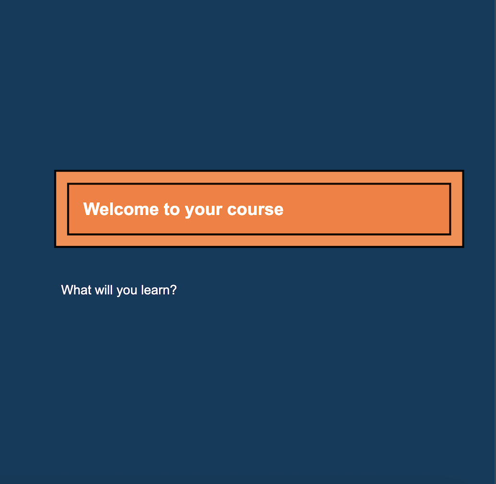

## Summary

In this assignment, you will be cutting and pasting text from the Companion to the text editor and seeing how it displays on a webpage. Your completed assignment should look like this figure (Figure 1.1)

Figure 1.1
